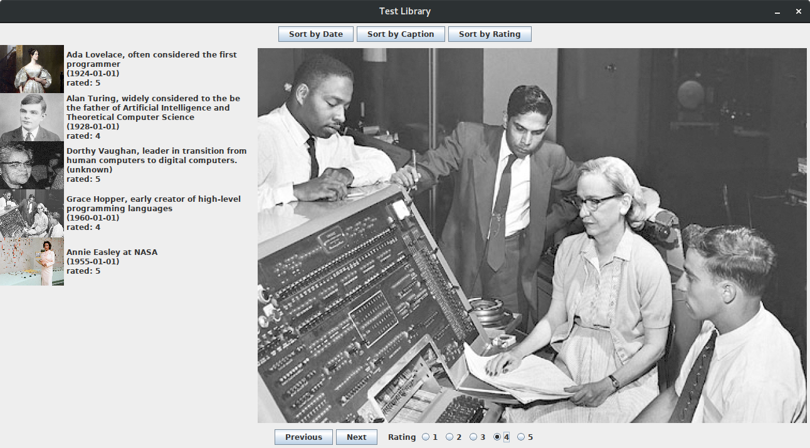
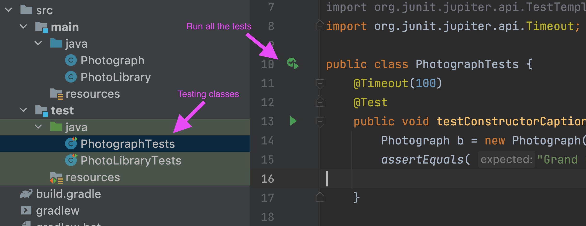
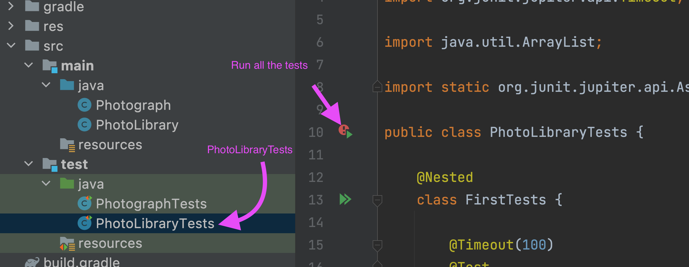
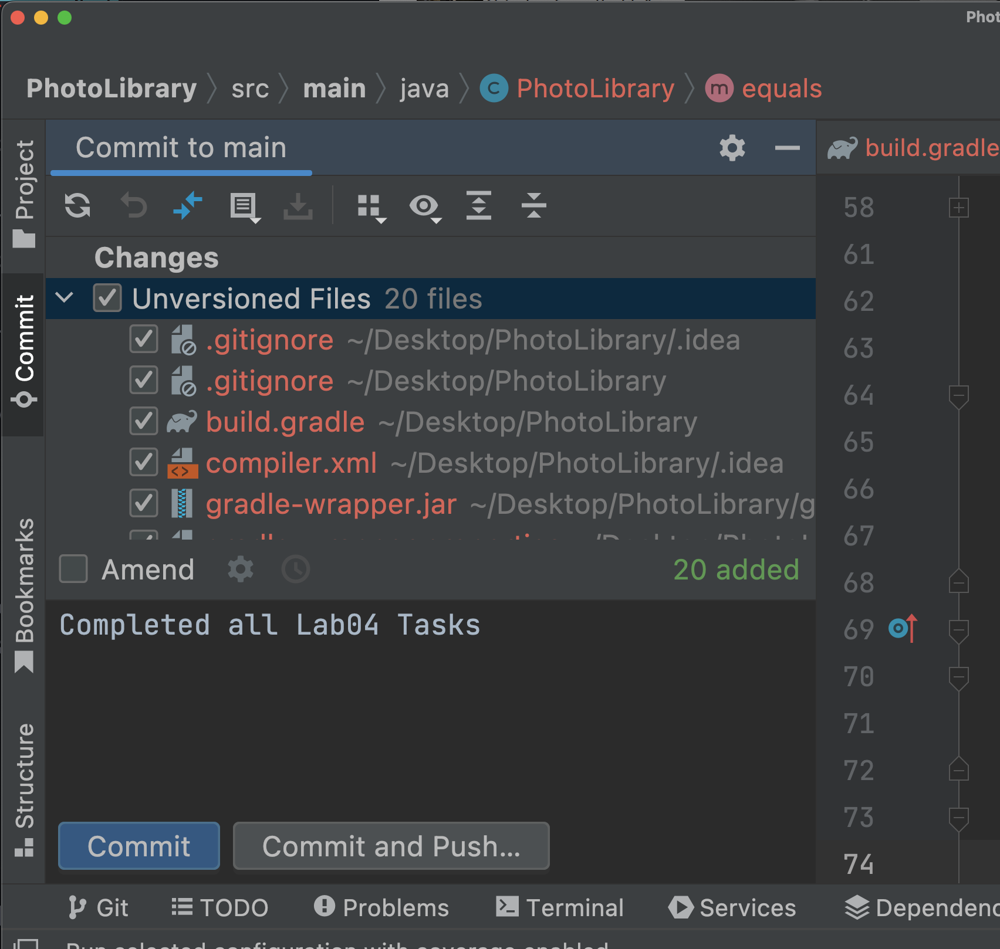

# Lab 04 PhotoLibrary

This lab is the start of a multi-lab project to build a photo library java GUI application.

## Learning Objectives

- implement code that utilizes String and primitive variable types
- create java object with getters and setters
- develop java classes that use instance of other classes
- implement an ArrayList to store a collection of items
- Implement and utilize static methods
- test our code and write a simple test case

## Overview

This is the first lab on a photograph application. We will create two foundational classes for our application:

- `Photograph`, and
- `PhotoLibrary`

A photograph for this lab will just be a caption and filename, whereas the PhotoLibrary has a name and the a list of photos the user has posted to their *photo feed*. To keep libraries straight they also have a unique id.

You are given some starter code as part of this repository and expected to complete each of the two classes (`Photograph` and `PhotoLibrary` as well as some unit-tests for each class)

## TODO 0: Clone/Open the project to your local computer using IntelliJ

`File->New->Project from Version Control`

Paste the .git url from Github and then sign in with web sign in.

## TODO 1:

Complete the Photograph class

- [ ]  create the instance fields
- [ ]  complete the constructor
- [ ]  complete the getters for the instance fields (there are no setters)
- [ ]  complete the equals and toString methods

`equals`: you are given some boiler plate code to start the method. Complete the method so that two photographs are equal if they have the same filename AND the same caption.

`toString`: complete toString so that it returns a concatenation of the file name and the caption.

## TODO 2: Run the PhotographTests

In the test directory you'll find two classes (PhotographyTests and PhotoLibraryTests)

You can run all of the tests in the PhotographTests class by clicking the green arrow next to the class definition.

- [ ] Ensure all the PhotographTests pass before advancing

This may require you to make some adjustments to your code from TODO 1.

## TODO 3: Add one unit-test for the Constructor

  - [ ] Create a test to ensure that the filename is set correctly (via access through the getter) when a Photograph is created.

    - [ ] use the other tests as examples of how to create these tests

These unit-tests are JUnit 5 (jupiter) tests. There are a number of assertions that are available in this testing framework. An assertion is something that should be known at a certain point in your program. `assert that after creating a Photograph instance called photo with a filename: myfile.png then photo.getFileName() should return a String that is equal to: "myfile.png"`. `

If the assertion fails then the so does the test case (and there must be a bug in the code).

After creating your testcase, run all the testcases once more and ensure they all pass.

## TODO 4: Read the PhotoLibrary code

- [ ] You are given the `basic` code for PhotoLibrary including the instance fields, constructors, getters (accessors) and setters (mutators), toString and equals.

## TODO 5: Complete the PhotoLibrary class

 Complete the following methods in the PhotoLibrary class:

 - [ ] `public int numPhotographs()`
Return the number of Photographs the current object has taken (in photos).

 - [ ] `public boolean addPhoto(Photograph p)`
Add the Photograph `p` to the list of the current object’s photos feed if and only if it was not already in that list. Return `true` if the Photograph was added; return `false` if it was not added.

- [ ] `public boolean hasPhoto(Photograph p)`
Return `true` if the current object has `p` in its list of photos. Otherwise return `false`.

- [ ] `public boolean erasePhoto(Photograph p)`
Once a photo is available online, it’s hard to delete. However, this particular `PhotoLibrary` may delete the photo from its feed. If Photograph `p` is in the current PhotoLibrary object’s list of Photographs, remove `p` from the current object’s list. Return `true` if the Photograph was removed or `false` if it was not found.

- [ ] `public static ArrayList<Photograph> commonPhotos(PhotoLibrary a, PhotoLibrary b)`
Return an ArrayList<Photograph> of the photos that both PhotoLibrary a and Pho- toLibrary b have posted to their feeds. Use the equals method of the Photograph class
to determine if two Photograph objects represent the same photograph.

- [ ] `public static double similarity(PhotoLibrary a, PhotoLibrary b)`
Returns a measure of how similar the photo feeds are between PhotoLibrary a and Pho- toLibrary b, in terms of a numerical value between 0 and 1. If either PhotoLibrary does not have any photos, the result is 0.0. Otherwise, it is the number of commonPhotos to both libraries divided by smaller of the number of photos in a’s feed and the number of photos in b’s feed. Remember how java does division (especially with integers).

## TODO 6: Run the unit-tests for the PhotoLibrary classes

- [ ] for full marks on the lab you just need to complete the FirstTests tests

## TODO 7: Commit and push your code and push it to Github.

- [ ] Github actions will automatically test your code
- [ ] Don't forget to push your code

 **Lab completed**
 Congratulations you have completed Lab 04
